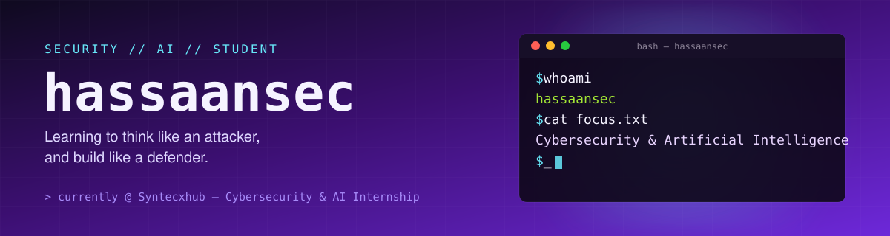

---

### 👨‍💻 About Me

- 🎓 Student focused on **Cybersecurity** and **Artificial Intelligence**
- 🐍 Comfortable with **Python**, **Linux**, **Git**, **GitHub**, and basic networking concepts
- 🔍 Currently learning: **Wireshark**, **Nmap**, **Kali Linux**
- 🛡️ Interested in ethical hacking, security fundamentals, and how AI applies to security
- 🤝 Open to: **Internships**, **Collaboration**, **Open Source**, **Learning Opportunities**
-  💼 **Cybersecurity Intern** at **Synctecxhub**

---

### 🧰 Tech Stack

**Languages**

**Tools & Platforms**

**Security (Learning)**

---

### 📜 Certifications

| Certification | Issuer |
|:---:|:---:|
| Introduction to Cybersecurity | Cisco |
| Introduction to Modern AI | Cisco |
| Cybersecurity Fundamentals | IBM SkillsBuild |
| Cybersecurity in Finance | Simplilearn |
| Introduction to Generative AI | Simplilearn × Google Cloud |
| Artificial Intelligence for Social Impact | ADBI |

---

### 📊 GitHub Stats

---

### 🟢 Status

Currently learning **Cybersecurity** and **Artificial Intelligence**, and open to internships, collaboration, open-source contributions, and new learning opportunities.

---

### 📫 Connect With Me

⭐ Thanks for stopping by — feel free to explore my repos and reach out!

